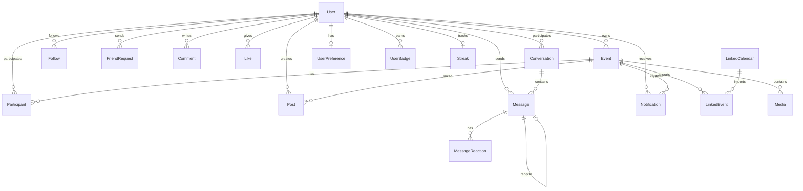
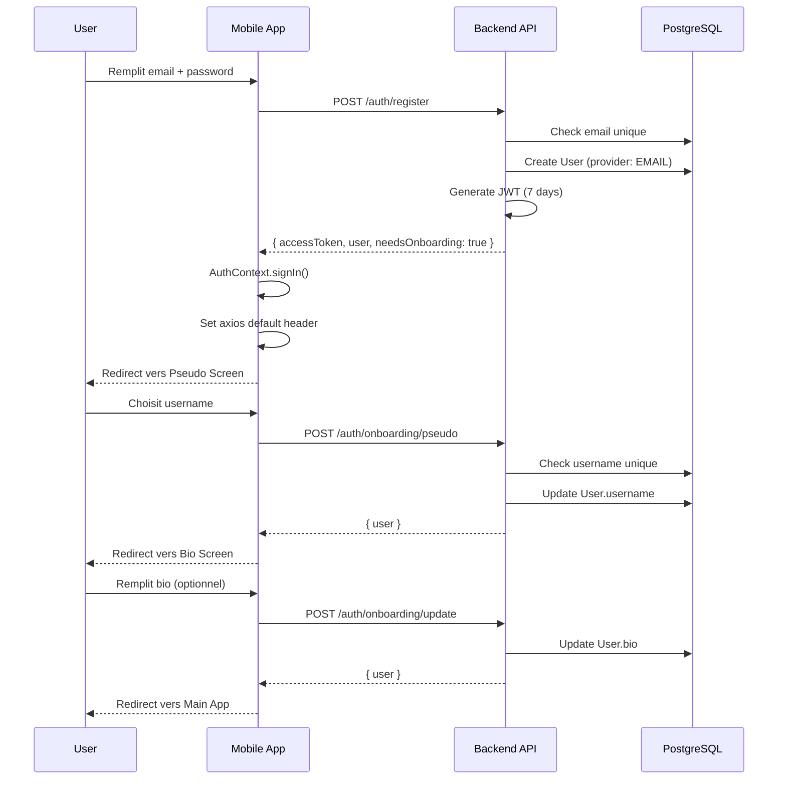
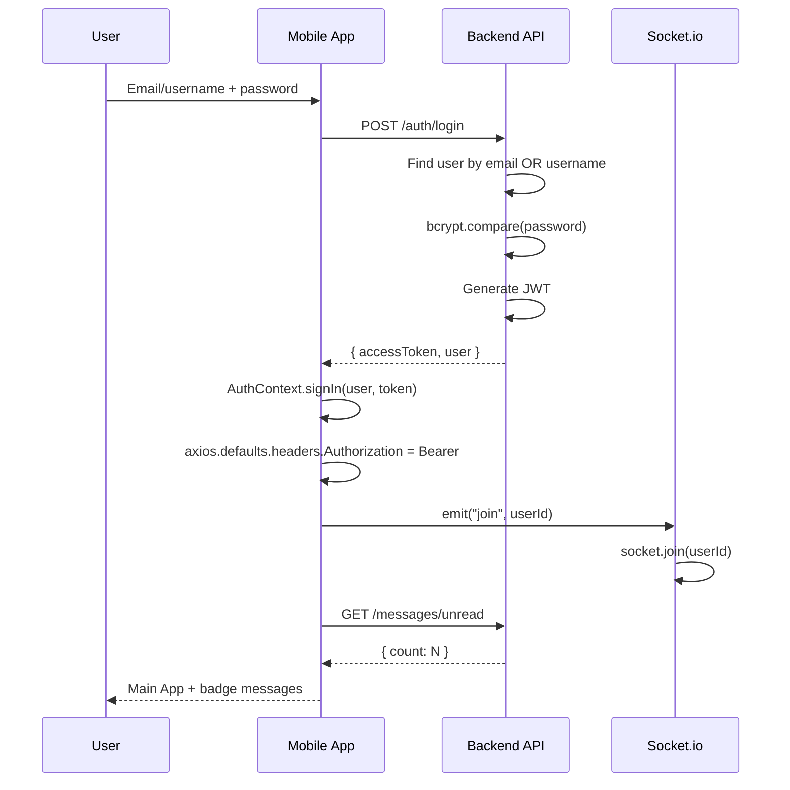
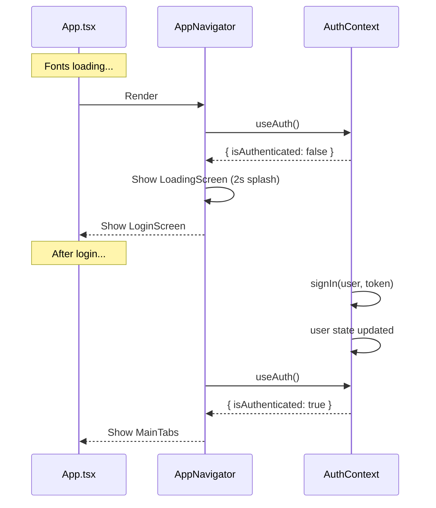
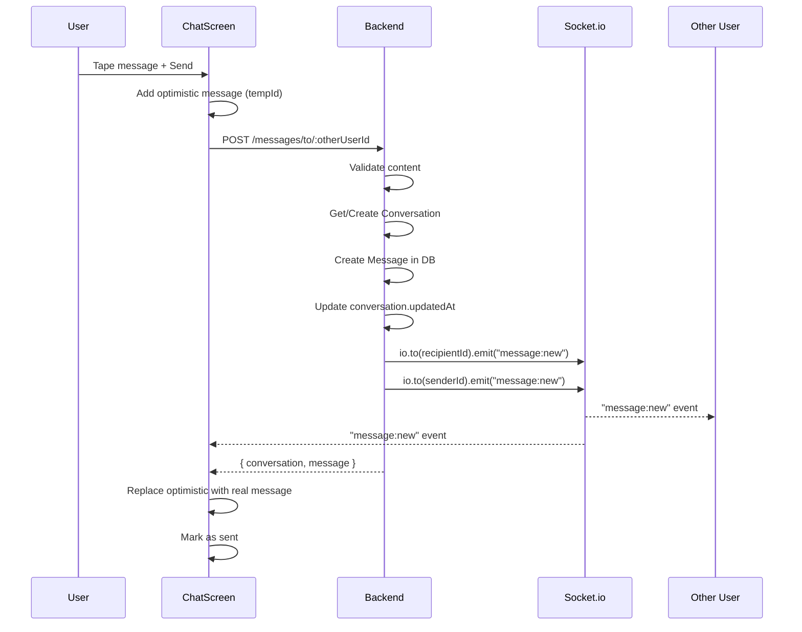
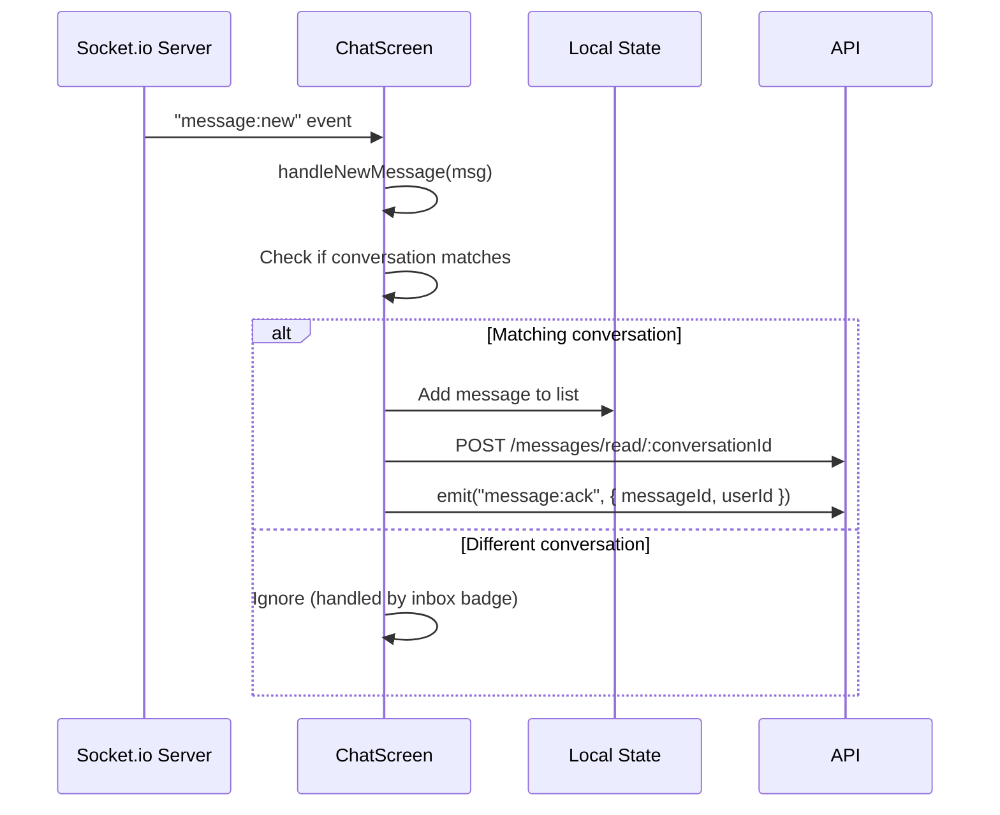
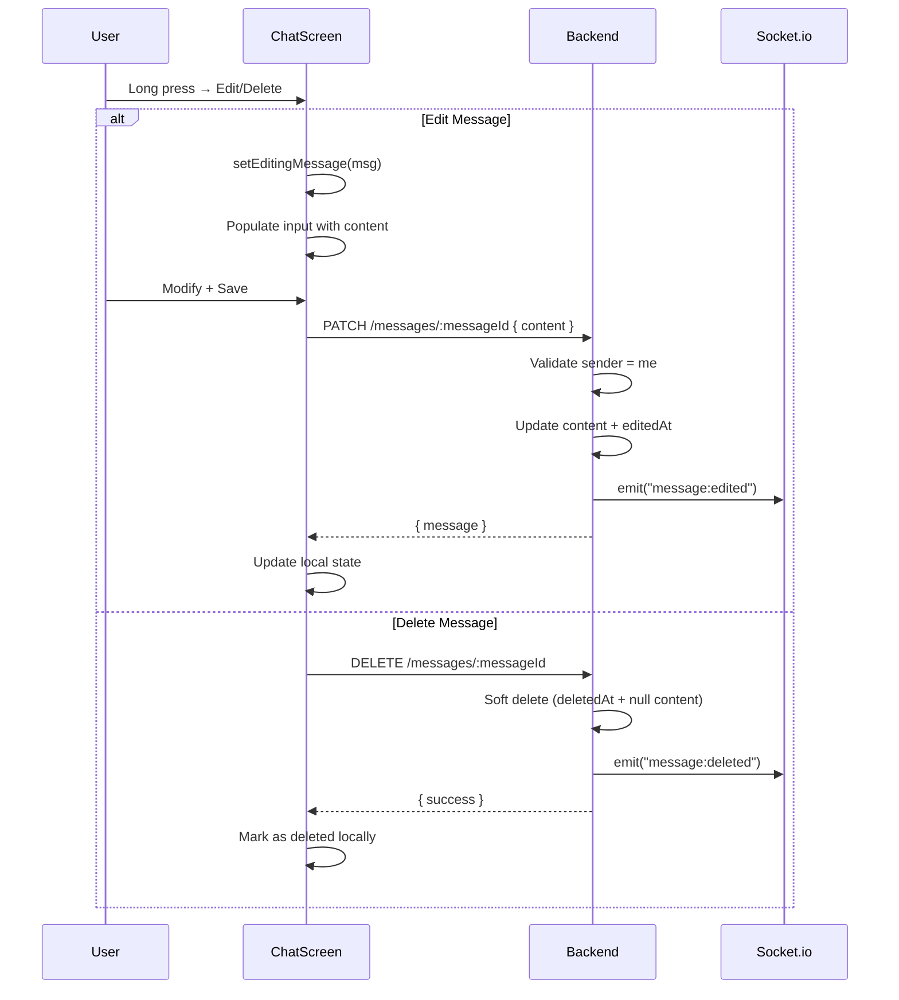
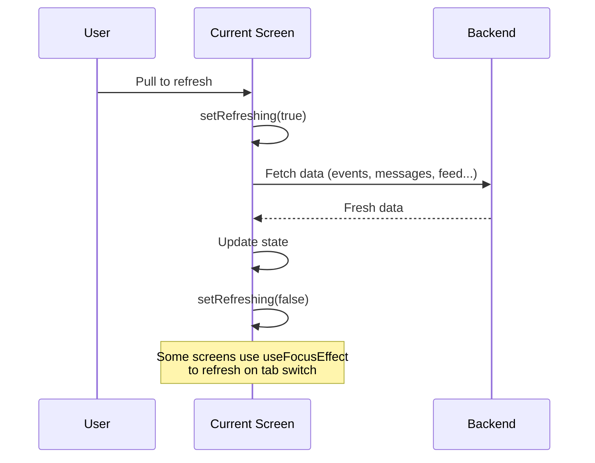

# 🏗️ LIFY — Analyse Architecturale Complète

> **Date d'analyse** : 3 janvier 2026  
> **Version** : 0.1.0 (Sprint 0)  
> **Base** : Code source uniquement — aucune invention

---

## ÉTAPE 1 — STACK TECHNIQUE GLOBALE

### Frontend Mobile

| Composant | Technologie | Version |
|-----------|-------------|---------|
| Framework | React Native (Expo) | `^54.0.0` |
| Runtime | React | `19.1.0` |
| Navigation | `@react-navigation/native` + bottom-tabs + native-stack | `^6.x` |
| Animations | `react-native-reanimated` | `~4.1.1` |
| Gestures | `react-native-gesture-handler` | `~2.28.0` |
| Clavier | `react-native-keyboard-controller` | `^1.20.2` |
| Audio | `expo-audio`, `expo-av` | `^1.1.1` / `~16.0.8` |
| Images | `expo-image`, `expo-image-picker` | `~3.0.11` / `~17.0.10` |
| Storage | `@react-native-async-storage/async-storage` | `2.2.0` |
| HTTP | `axios` | `^1.12.2` |
| Realtime | `socket.io-client` | `^4.8.3` |
| Blur/Effects | `expo-blur`, `expo-linear-gradient` | `~15.0.8` |
| Fonts | `@expo-google-fonts/montserrat`, `@expo-google-fonts/montserrat-alternates` | `^0.4.x` |
| Icons | `@expo/vector-icons` (Ionicons) | `^15.0.3` |
| Haptics | `expo-haptics` | `~15.0.8` |

### Backend API

| Composant | Technologie | Version |
|-----------|-------------|---------|
| Framework | Fastify | `^4.28.1` |
| Langage | TypeScript (tsx watch) | `^5.6.3` |
| ORM | Prisma Client | `^6.17.1` |
| Auth | JWT (jsonwebtoken) + bcryptjs | `^9.0.2` / `^3.0.3` |
| Validation | Zod | `^3.25.76` |
| Realtime | Socket.io (avec Redis Adapter optionnel) | `^4.8.1` |
| File Upload | `@fastify/multipart` | `^8.3.0` |
| Static Files | `@fastify/static` | `^7.0.4` |
| Object Storage | MinIO (S3-compatible) | `^8.0.6` |
| External Auth | `google-auth-library` | `^10.4.1` |
| ICS Parsing | `node-ical` | `^0.22.0` |
| Date Utils | `date-fns` | `^4.1.0` |

### Base de Données

| Composant | Technologie |
|-----------|-------------|
| SGBD | PostgreSQL | `16-alpine` (Docker) |
| Cache/Pub-Sub | Redis | `7-alpine` (Docker) |
| Object Storage | MinIO | `latest` (Docker) |
| Email Dev | MailHog | `latest` (Docker) |

### Schéma DB — Modèles Prisma (20+)



**Modèles principaux** :
- `User` — Profils (email/password ou Google OAuth)
- `Event` — Événements avec visibilité (PRIVATE/FRIENDS/LINK/PUBLIC)
- `Conversation` / `Message` — Messagerie 1-to-1
- `Follow` — Abonnements (Twitter-style)
- `Post` / `Comment` / `Like` — Social feed
- `LinkedCalendar` / `LinkedEvent` — Import calendriers externes
- `Notification` — Système de notifications
- `Badge` / `UserBadge` / `Streak` — Gamification

### Authentification

- **JWT Access Token** (7 jours expiration)
- **Providers** : Email/Password ou Google OAuth
- **Flow** : 
  1. `POST /auth/register` ou `POST /auth/login` ou `POST /auth/google`
  2. Token stocké côté client (mémoire via `AuthContext`)
  3. Header `Authorization: Bearer <token>` auto-injecté par Axios
- **Onboarding** : `/auth/onboarding/pseudo` + `/auth/onboarding/update` après inscription

### Temps Réel (Socket.io)

- **Transport** : WebSocket uniquement (requis pour React Native)
- **Rooms** : Chaque user rejoint une room de son `userId`
- **Events émis** :
  - `message:new` (nouveau message)
  - `message:read` (messages lus)
  - `message:edited` (message modifié)
  - `message:deleted` (message supprimé)
  - `message:updated` (delivery status)
  - `reaction:added` / `reaction:removed`
- **Redis Adapter** : Optionnel (fallback in-memory si Redis indisponible)

### Infrastructure / Hosting

- **Dev** : Docker Compose local
  - PostgreSQL `:5432`
  - Redis `:6379`
  - MinIO `:9000` (console `:9001`)
  - MailHog `:1025` (SMTP) / `:8025` (UI)
- **API** : `localhost:3000` (configurable)
- **Mobile** : Expo Go / Dev Build
- **Prod** : Non configuré (placeholder `https://api.lify.app`)

---

## ÉTAPE 2 — ARCHITECTURE DU PROJET

### Arborescence Complète

```
Lify/
├── apps/
│   ├── api/                          # Backend Fastify
│   │   ├── prisma/
│   │   │   └── schema.prisma         # Schéma DB (465 lignes, 20+ modèles)
│   │   ├── src/
│   │   │   ├── index.ts              # Point d'entrée, plugins, routes
│   │   │   ├── socket.ts             # Setup Socket.io + Redis adapter
│   │   │   ├── lib/
│   │   │   │   ├── auth.ts           # Middleware JWT (requireAuth)
│   │   │   │   ├── prisma.ts         # Singleton Prisma client
│   │   │   │   ├── minio.ts          # Client MinIO + bucket init
│   │   │   │   └── password.ts       # Hash/compare bcrypt
│   │   │   └── routes/
│   │   │       ├── auth.ts           # Login, register, onboarding, me, profile update
│   │   │       ├── events.ts         # CRUD events, participants, visibility, feed
│   │   │       ├── messages.ts       # Conversations, messages, reactions, edit/delete
│   │   │       ├── users.ts          # Search, profile, follow/unfollow, friends
│   │   │       ├── posts.ts          # Posts, likes, comments, feed
│   │   │       ├── friends.ts        # Friend requests (legacy)
│   │   │       ├── uploads.ts        # File upload to MinIO
│   │   │       ├── linkedCalendars.ts# Import ICS / Google Calendar
│   │   │       ├── preferences.ts    # User preferences
│   │   │       ├── notifications.ts  # Notifications list/mark read
│   │   │       └── gamification.ts   # Badges, streaks
│   │   ├── uploads/                  # Local uploads (dev)
│   │   ├── generated/                # Prisma generated client
│   │   └── package.json
│   │
│   └── mobile/                       # App React Native Expo
│       ├── App.tsx                   # Root avec providers
│       ├── src/
│       │   ├── navigation/
│       │   │   └── AppNavigator.tsx  # Navigation structure
│       │   ├── context/
│       │   │   └── AuthContext.tsx   # Auth state global
│       │   ├── services/
│       │   │   ├── api.ts            # Axios client + helpers
│       │   │   ├── socket.ts         # Socket.io singleton
│       │   │   ├── eventService.ts   # Events API + cache
│       │   │   ├── accountStorage.ts # Multi-account storage
│       │   │   └── themeService.ts   # User themes
│       │   ├── stores/
│       │   │   ├── AudioPlayerStore.ts    # Singleton audio player
│       │   │   └── AudioRecordingStore.ts # Recording state machine
│       │   ├── screens/              # 22 écrans
│       │   │   ├── LoginScreen.tsx
│       │   │   ├── SignUpScreen.tsx
│       │   │   ├── PseudoScreen.tsx / BioScreen.tsx / AvatarScreen.tsx (onboarding)
│       │   │   ├── HomeScreen.tsx           # Feed (Pour vous / Abonnements)
│       │   │   ├── SearchScreen.tsx         # Recherche users
│       │   │   ├── MessagesScreen.tsx       # Inbox conversations
│       │   │   ├── NewMessageScreen.tsx     # Nouvelle conversation
│       │   │   ├── ChatScreen.tsx           # Conversation (1200+ lignes)
│       │   │   ├── ConversationSettingsScreen.tsx
│       │   │   ├── ProfileScreen.tsx        # Mon profil + calendrier
│       │   │   ├── UserProfileScreen.tsx    # Profil autre user
│       │   │   ├── EditProfileScreen.tsx
│       │   │   ├── ProfileControlCenterScreen.tsx # Paramètres profil
│       │   │   ├── MyEventsScreen.tsx       # Mes événements
│       │   │   ├── SettingsScreen.tsx
│       │   │   ├── AccountSwitcherScreen.tsx# Multi-comptes
│       │   │   └── ... (autres)
│       │   ├── components/           # 21+ composants
│       │   │   ├── chat/             # Composants chat spécialisés
│       │   │   │   ├── ChatMessageItem.tsx
│       │   │   │   ├── ChatInputBar.tsx
│       │   │   │   ├── ChatContextMenu.tsx
│       │   │   │   ├── ChatReplyBanner.tsx
│       │   │   │   ├── ChatDaySeparator.tsx
│       │   │   │   └── EmojiReactionBar.tsx
│       │   │   ├── LiquidGlassTabBar.tsx  # Tab bar custom (blur glass effect)
│       │   │   ├── ProfileTimeline.tsx    # Calendrier profil
│       │   │   ├── ProfileHeader.tsx
│       │   │   ├── EventEditSheet.tsx     # Bottom sheet création événement
│       │   │   ├── FeedEventItem.tsx
│       │   │   ├── ConversationItem.tsx
│       │   │   ├── AudioMessage.tsx
│       │   │   ├── Waveform.tsx
│       │   │   └── ... (autres)
│       │   ├── types/
│       │   │   └── events.ts         # Types CalendarEvent
│       │   ├── config/
│       │   │   └── api.ts            # API_BASE_URL config
│       │   ├── constants/
│       │   └── theme.ts              # Design tokens (colors, spacing, typography)
│       ├── ARCHITECTURE.md           # Doc architecture mobile
│       ├── LINT_DEBT.md              # Dette technique lint
│       └── POST_CLEANUP_AUDIT.md     # Audit post-cleanup
│
├── packages/
│   ├── types/                        # Types partagés (placeholder)
│   └── ui/                           # UI partagé (placeholder)
│
├── docker-compose.yml
├── package.json                      # Monorepo config (workspaces)
├── tsconfig.json
├── eslint.config.js
└── CLEANUP_REPORT.md
```

### Rôle des Dossiers Clés

| Dossier | Rôle |
|---------|------|
| `apps/api/src/routes/` | 11 fichiers route Fastify, chacun un domaine métier |
| `apps/api/src/lib/` | Utilitaires partagés (auth, db, storage, crypto) |
| `apps/mobile/src/screens/` | 22 écrans React Native |
| `apps/mobile/src/components/` | Composants réutilisables (tab bar, items, headers) |
| `apps/mobile/src/components/chat/` | Composants spécifiques au chat (7 fichiers) |
| `apps/mobile/src/services/` | Couche API/Socket/Cache |
| `apps/mobile/src/stores/` | State machines audio (2 singletons) |
| `apps/mobile/src/context/` | State global React (Auth) |

### Fichiers Clés

| Fichier | Rôle | Lignes |
|---------|------|--------|
| `schema.prisma` | Schéma complet DB | 465 |
| `ChatScreen.tsx` | Écran conversation (le plus complexe) | 1200+ |
| `messages.ts` (API) | Routes messagerie complètes | 462 |
| `events.ts` (API) | Routes événements | 511 |
| `auth.ts` (API) | Auth + onboarding | 377 |
| `AppNavigator.tsx` | Structure navigation | 167 |
| `AuthContext.tsx` | State auth global + socket join | 138 |

---

## ÉTAPE 3 — FLUX FONCTIONNELS

### 📝 Inscription



### 🔐 Connexion



### 📱 Chargement Utilisateur (App Restart)



> ⚠️ **Note** : Pas de persistence token dans AsyncStorage actuellement. Logout = perte session.

### 💬 Envoi de Message



### 📨 Réception Temps Réel



### ✏️ Édition / Suppression



### 🔄 Rafraîchissement App



---

## ÉTAPE 4 — ÉTAT ACTUEL DU PRODUIT

### ✅ Ce qui fonctionne parfaitement

| Feature | Détail |
|---------|--------|
| **Auth Email/Password** | Inscription, connexion, JWT, déconnexion |
| **Onboarding** | Flow pseudo → bio → avatar |
| **Navigation** | Tabs + Stacks, animations fluides |
| **Messagerie 1-to-1** | Envoi texte, image, audio |
| **Temps réel messages** | Réception instantanée via Socket.io |
| **Reply to message** | Répondre à un message spécifique |
| **Réactions emoji** | Ajouter/supprimer réactions |
| **Edit/Delete messages** | Modification + soft delete |
| **Audio recording** | Hold-to-record, slide-to-cancel, slide-to-lock |
| **Audio playback** | Play/pause, progress bar, speed control |
| **Event CRUD** | Création, modification, suppression d'événements |
| **Event visibility** | PRIVATE/FRIENDS/LINK/PUBLIC |
| **Calendrier profil** | Timeline avec événements |
| **Follow/Unfollow** | Système d'abonnements |
| **Search users** | Recherche par username/email |
| **Feed events** | Events de moi + followings |
| **UI Design** | Theme cohérent, Liquid Glass TabBar |

### ⚠️ Ce qui fonctionne mais est fragile

| Feature | Problème | Risque |
|---------|----------|--------|
| **Optimistic messages** | `tempId` → `realId` replacement parfois buggy | Clés dupliquées possibles |
| **Socket reconnection** | Re-join room manuel | Perte messages si déconnexion longue |
| **Audio duration** | Parfois 0ms stocké | Fallback endpoint PATCH existe |
| **Large message lists** | FlatList + 1200 lignes code | Performance sur vieux devices |
| **Auth persistence** | Pas de stockage AsyncStorage | Logout au restart app |
| **Redis adapter** | Fallback in-memory si down | Single-server only sans Redis |

### 🟡 Ce qui est partiellement implémenté

| Feature | État | Manque |
|---------|------|--------|
| **Google OAuth** | Endpoint existe | Flow mobile non connecté |
| **Posts/Feed social** | API complète | UI mobile non implémentée |
| **Comments** | API complète | UI mobile non implémentée |
| **Likes** | API complète | UI partiellement (feed events) |
| **Friend Requests** | Model + Routes | UI non implémentée (legacy?) |
| **Notifications** | Model + Routes | Push notifications absentes |
| **Linked Calendars** | ICS parsing existe | UI import non visible |
| **Gamification** | Badges/Streaks modèles | Logique non connectée |
| **Multi-accounts** | AccountSwitcher screen | Persistence incomplète |
| **Mute conversations** | UI exists | Backend non implémenté |
| **@mentions** | Prévu | Non commencé |

### 🔴 Ce qui est prévu mais pas commencé

| Feature | Indice dans le code |
|---------|---------------------|
| **Push notifications** | Model Notification existe, pas de token device |
| **Pagination messages** | Cursor existe, scroll infini partiel |
| **Media messages preview** | Image picker ok, preview avant envoi manquant |
| **Typing indicators** | Non implémenté |
| **Message search** | Non implémenté |
| **Group conversations** | Model 1-to-1 only |
| **Event sharing deep links** | shareCode existe, deep link non configuré |
| **Email verification** | MailHog setup, flow non implémenté |
| **Password reset** | Non implémenté |
| **Rate limiting** | Non implémenté |
| **Tests automatisés** | Aucun test |

---

## ÉTAPE 5 — CHOIX TECHNIQUES & DETTES

### Choix Techniques Faits

| Choix | Justification | Impact |
|-------|---------------|--------|
| **Monorepo npm workspaces** | Partage de code (types, UI à venir) | Config simple, pas de Turborepo |
| **Fastify over Express** | Performance, plugins, TypeScript natif | Moins de middleware disponibles |
| **Prisma over TypeORM** | DX supérieure, migrations faciles | Generated client lourd |
| **Socket.io** | Fallback, rooms, Redis adapter | Overhead vs WebSocket pur |
| **expo-audio (new)** | API moderne, remplace expo-av | Moins de docs/exemples |
| **react-native-reanimated** | Animations UI thread | Complexité setup |
| **Singleton stores** | Audio player/recorder | Pas de React Query, state manuel |
| **JWT sans refresh** | Simplicité MVP | Token 7j, pas de révocation |
| **MinIO local** | S3-compatible, dev facile | Config prod à faire |
| **Soft delete messages** | Historique préservé | Query plus complexes |

### Compromis Acceptés

| Compromis | Raison |
|-----------|--------|
| Pas de TypeScript strict everywhere | Rapidité dev, `any` toléré (~60 occurrences) |
| Auth non persistée | Évite complexité AsyncStorage + refresh token |
| Single conversation model | MVP 1-to-1, groups plus tard |
| Pas de tests | Itération rapide, tech debt assumée |
| FR-only UI | Marché cible initial |

### Dettes Techniques Existantes

| Dette | Fichier(s) | Sévérité |
|-------|------------|----------|
| **~60 `no-explicit-any`** | Partout | 🟡 Moyenne |
| **ChatScreen.tsx 1200+ lignes** | ChatScreen.tsx | 🟠 Haute |
| **Variables unused** | Callbacks | 🟢 Basse |
| **Auth pas persistée** | AuthContext.tsx | 🟠 Haute |
| **Pas de error boundaries** | Global | 🟡 Moyenne |
| **Pas de React Query** | Services | 🟡 Moyenne |
| **Pas de schema validation client** | api.ts | 🟡 Moyenne |
| **Double GestureHandlerRootView** | App.tsx + AppNavigator | 🟢 Basse |

### Warnings Connus

```
⚠️ Redis not available, falling back to in-memory Socket.io
⚠️ Minio seems down, uploads might fail.
```

### Hacks Temporaires

| Hack | Fichier | Description |
|------|---------|-------------|
| `require("./lib/prisma")` | socket.ts:49 | Lazy require pour éviter circular deps |
| `(app as any).io` | Plusieurs routes | Cast pour accès Socket.io |
| `(reply as any).sent` | Toutes les routes | Check si réponse déjà envoyée |
| Fake splash delay | AppNavigator:129 | `setTimeout(2000)` artificiel |
| Dev mock login | auth.ts:196 | `/dev/mock-login` en prod aussi |

---

## ÉTAPE 6 — CONTRAINTES IMPORTANTES

### 🔒 Ce qui ne doit PAS être cassé

| Élément | Raison |
|---------|--------|
| **Flow d'authentification** | Base de toute l'app |
| **Socket room join** | Temps réel messagerie |
| **Message ordering** | `createdAt DESC` + cursor pagination |
| **Conversation pair uniqueness** | `@@unique([userAId, userBId])` |
| **Soft delete pattern** | `deletedAt` pour messages/convos |
| **Event ownership** | `ownerId` pour CRUD |
| **JWT secret** | Invaliderait tous les tokens |

### 🌐 Dépendances API Existantes

| Client attend | Endpoint | Format |
|---------------|----------|--------|
| Login response | POST /auth/login | `{ accessToken, user }` |
| Me response | GET /me | `{ user: { ...stats } }` |
| Conversations | GET /conversations | Array avec `unreadCount` |
| Messages | GET /messages/with/:id | `{ messages, nextCursor }` |
| Send message | POST /messages/to/:id | `{ conversation, message }` |
| Events | GET /events | Array d'Event |
| Feed | GET /feed/events | `{ items, nextCursor }` |
| User profile | GET /users/:id | `{ ...user, isFollowing, metrics }` |

### ⚡ Parties Risquées à Modifier

| Zone | Risque si modifiée |
|------|-------------------|
| **schema.prisma** | Migration DB requise, downtime |
| **socket events naming** | Cassera client/server sync |
| **JWT payload shape** | Invalidera tokens existants |
| **API response shapes** | Cassera mobile |
| **Navigation stack names** | Cassera deep links futurs |
| **Theme tokens** | Impact UI global |

### 🛡️ Parties Sensibles (Sécurité)

| Partie | Sensibilité |
|--------|-------------|
| **JWT_ACCESS_SECRET** | Critique — compromise = tous les comptes |
| **Password hashing** | bcrypt rounds = 10 (défaut) |
| **Auth middleware** | `requireAuth` — gate sur toutes les routes protégées |
| **File uploads** | Validation MIME + size limit 5MB |
| **Message sender check** | Edit/delete vérifie `senderId === me` |
| **Event owner check** | CRUD vérifie `ownerId` ou `participant.role === HOST` |
| **SQL injection** | Prisma (paramétré) — safe |
| **XSS** | Pas de HTML rendu — safe pour l'instant |

---

## RÉSUMÉ EXÉCUTIF

**Lify** est une application sociale mobile de gestion d'événements avec messagerie temps réel, en phase MVP (Sprint 0).

### Forces
- Architecture monorepo propre
- Stack moderne et performante
- Temps réel fonctionnel
- UI soignée avec design système cohérent
- Messagerie riche (audio, images, réactions)

### Faiblesses
- Pas de tests automatisés
- Auth non persistée
- ChatScreen monolithique
- Types TypeScript laxistes
- Features sociales (posts) non connectées UI

### Priorités Recommandées
1. **Persister l'auth** (AsyncStorage + refresh token)
2. **Refactorer ChatScreen** (extraire hooks, split composants)
3. **Ajouter types stricts** (interfaces User, Message, Event)
4. **Implémenter push notifications**
5. **Connecter UI feed posts**

---

> Ce document représente l'état exact du code au 3 janvier 2026.  
> Toute modification future devra être reflétée ici.
